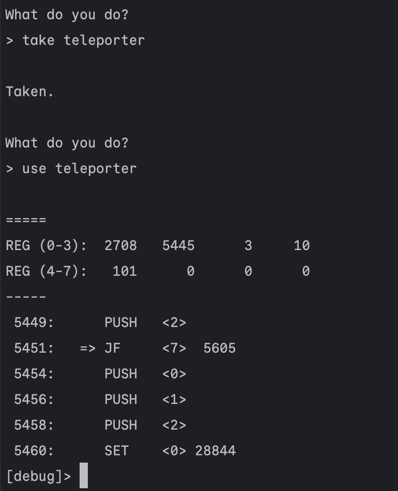

# Synacor Challenge implemented in Zig

## Build

`zig build`

compile and run:

`zig build run`

## In-app instructions

To enable debug mode enter `.debug` in regular prompt.

### Debug instructions:

* `<enter>` - go to the next instruction;

* `set` `<reg_id>` `<value>` - set register's value.

where `<reg_id>` is number `0-7`;
`<value>` is number in range `[0-32768)`;

* `breakpoint` (or `b`) `<address>` - add breakpoint for `<address>`;

* `continue` (or `c`) - resume execution;

* `exit` - exit from app;

## Screenshots

